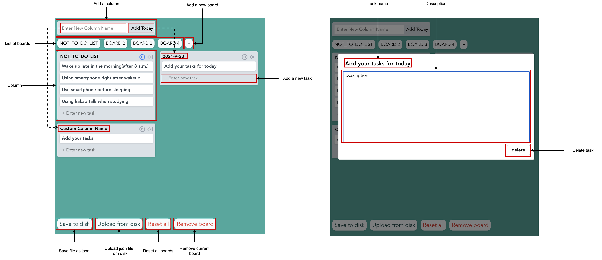

# NOT TO DO LIST 

## Link 
* [Not to do list](https://seonwoo960000.github.io/not-to-do-list/)
## Reference 
* [Vue mastery trello clone](https://github.com/Code-Pop/watch-us-build-trello/releases/tag/lesson-9-complete)
* [Youtube - Why not-to-do-list is important](https://www.youtube.com/watch?v=gmrs8UxAZwo&t=295s)

## Why Not-To-Do-List
* Most successful people not only have a to-do list but also a not-to-do-list
* More efficient way to manage time
* To be a better person

## How to use this application 

#### I'm currently using github.io to host my application 
### Features
- CRUD boards 
- CRUD tasks 
- Drag and drop board 
- Drag and drop task 
- Save boards in disk (json format)
- Upload json file to boards

### Project setup 
```
yarn install
```

### Compiles and hot-reloads for development
```
yarn run serve
```

### Compiles and minifies for production
```
yarn run build
```

### Run your tests
```
yarn run test
```

### Lints and fixes files
```
yarn run lint
```
